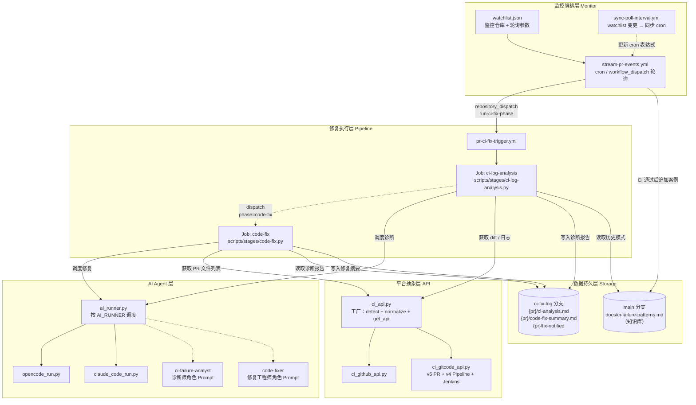
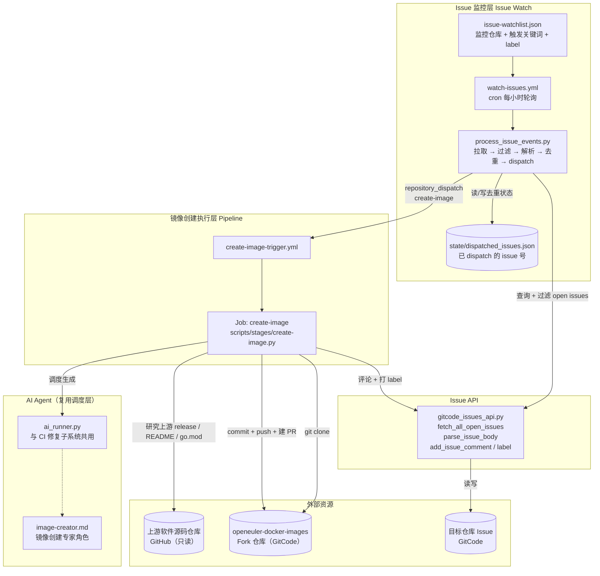
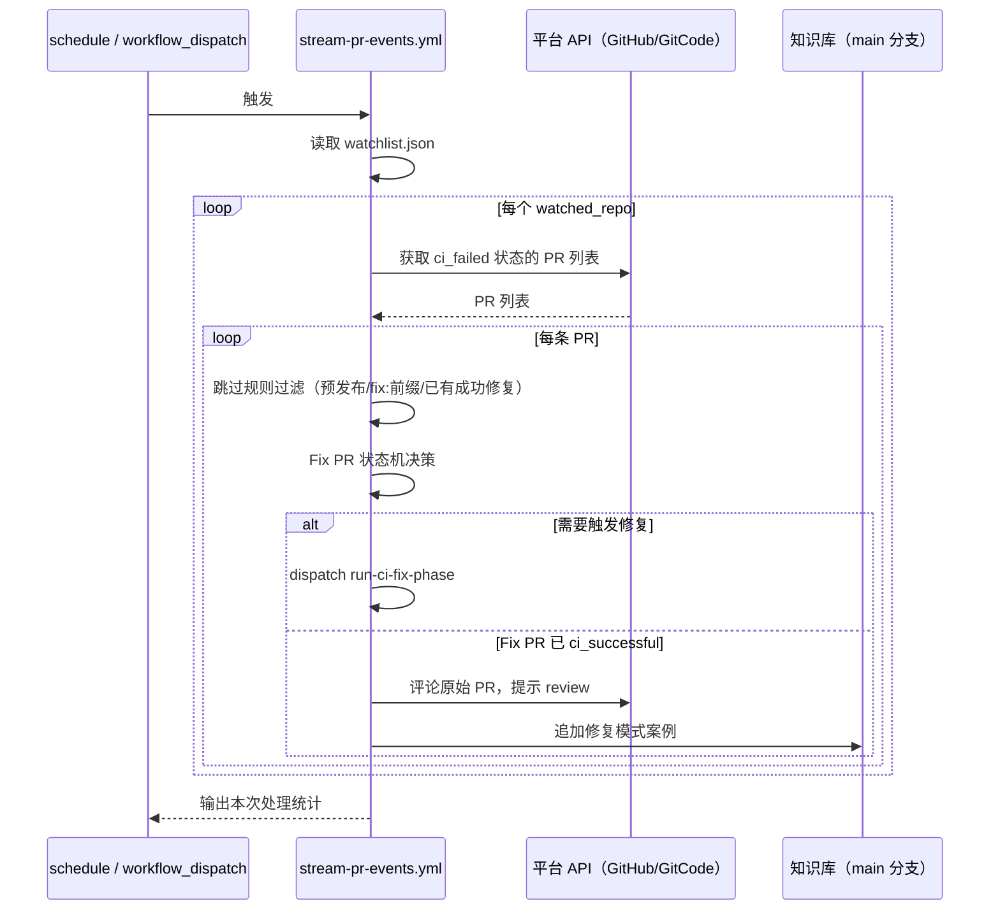
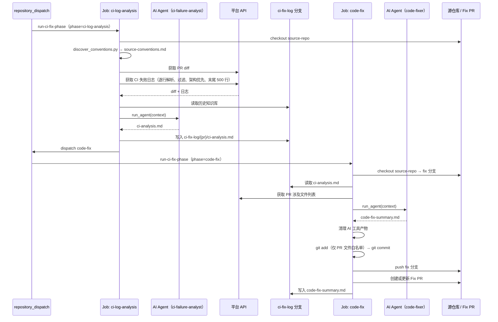
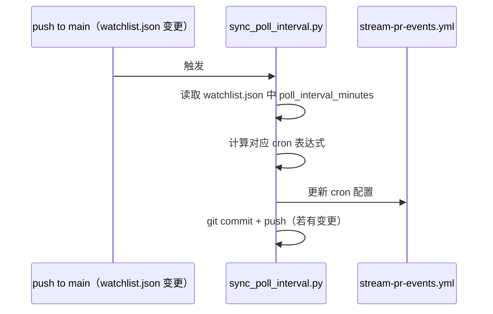
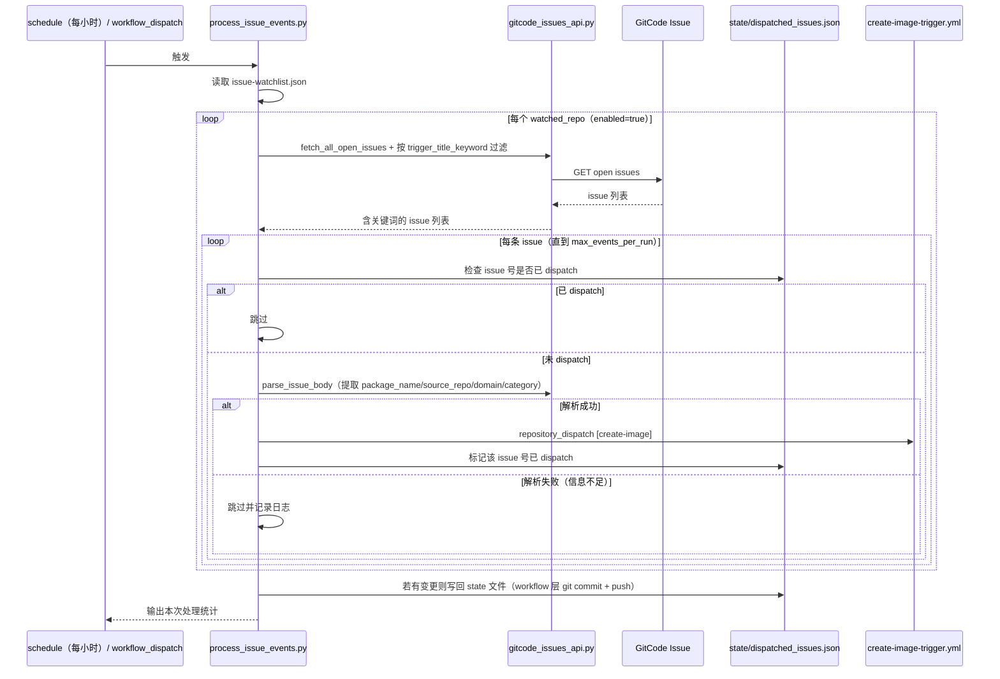
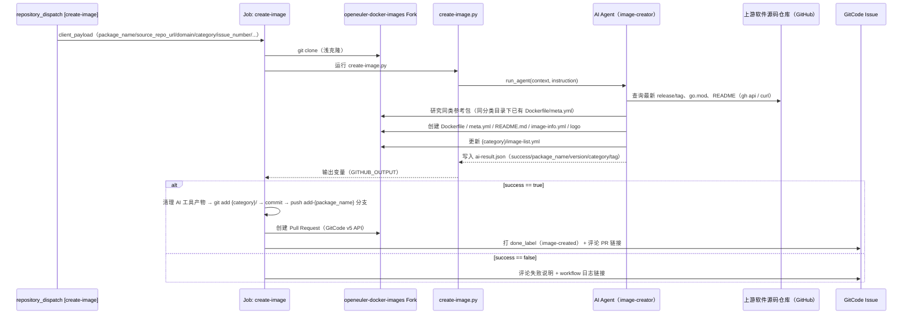
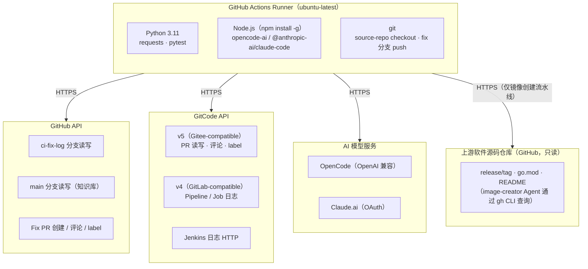

# docker-images-workflow — 系统设计文档

**状态:** 已发布
**日期:** 2026-06-15
**版本:** 1.0

---

## 目录

1. [系统概述](#一系统概述)
2. [架构设计](#二架构设计)
   - [2.1 逻辑视图](#21-逻辑视图)
   - [2.2 开发视图](#22-开发视图)
   - [2.3 进程视图](#23-进程视图)
   - [2.4 物理视图](#24-物理视图)
   - [2.5 场景视图](#25-场景视图)
3. [组件详解](#三组件详解)
   - [3.1 监控编排层](#31-监控编排层)
   - [3.2 修复执行层](#32-修复执行层)
   - [3.3 AI Agent 层](#33-ai-agent-层)
   - [3.4 平台抽象层](#34-平台抽象层)
   - [3.5 数据持久层](#35-数据持久层)
   - [3.6 Issue 监控层](#36-issue-监控层)
   - [3.7 镜像创建层](#37-镜像创建层)
4. [关键设计决策](#四关键设计决策)
5. [安全设计](#五安全设计)
6. [性能设计](#六性能设计)
7. [扩展性设计](#七扩展性设计)
8. [技术选型](#八技术选型)

---

## 一、系统概述

docker-images-workflow 是一套面向容器镜像仓库的自动化工作流集合，以 GitHub Actions 作为编排引擎，以 AI 大模型（DeepSeek / Claude 等）作为执行者，包含两条相互独立、并行运行的流水线：

| 子系统 | 触发方式 | 职责 |
|--------|---------|------|
| **CI 修复流水线** | 轮询目标仓库 `ci_failed` 标签的 PR | 诊断 CI 失败根因并自动提交修复 PR |
| **镜像创建流水线** | 轮询目标仓库带「【new-image】」关键词的 Issue | 为新增上游软件包自动生成 Dockerfile 等镜像文件并提交 PR |

两条流水线共用同一套 AI Agent 调度层（`ai_runner.py`），但各自拥有独立的触发配置、平台 API 封装和角色 Prompt，互不干扰。

### 1.1 设计原则

| 原则 | 说明 |
|------|------|
| **两阶段分离** | CI 修复的诊断（ci-log-analysis）和修复（code-fix）各自独立运行，通过 ci-fix-log 分支传递数据，互不耦合 |
| **配置驱动** | `watchlist.json` / `issue-watchlist.json` 控制监控目标和轮询参数，无需修改 workflow 文件即可扩展 |
| **平台无关** | CI 修复阶段脚本通过工厂层调用平台 API，业务逻辑不感知 GitCode/GitHub 的差异 |
| **知识反馈** | Fix PR 通过 CI 验证后，修复模式自动写入知识库，下次同类失败置信度显著提升 |
| **自管理生命周期** | Fix PR 从创建到通过或关闭，全程由工作流自主管理，无需人工干预修复中间状态 |
| **最小化修改** | AI 修复工程师严格限定只修改原始 PR 涉及的文件，不引入范围外改动 |
| **证据驱动** | 诊断报告的每个结论必须有日志依据；日志显示成功时，强制判定为证据不足，不做强行分析 |
| **只新增不改动** | 镜像创建 Agent 严格限定只创建新文件，不修改仓库内已有软件包的任何文件 |
| **AI 调度层复用** | CI 修复与镜像创建共用 `ai_runner.py` 的多后端调度能力，避免重复实现 OpenCode/Claude Code 封装 |

### 1.2 核心能力一览

| 能力 | 实现方式 |
|------|---------|
| 精准日志抓取 | 逐行解析评论 HTML 表格，只取 FAILED 行的 URL，过滤编排层，架构标识优先 |
| 历史知识库 | `docs/ci-failure-patterns.md`，按失败模式分类，自动追加，自动参考 |
| Fix PR 自管理 | 基于 label 状态机决策，失败追加 commit，超限自动关闭 |
| 多平台支持 | URL 识别平台，API 层完全隔离（GitCode v5/v4 + GitHub REST） |
| 多 AI 后端 | 通过 `AI_RUNNER` 变量切换 OpenCode 和 Claude Code，接口统一 |
| 智能跳过 | 预发布版本正则过滤 + Fix PR 标题过滤 + 已有成功修复检测 |
| Issue 驱动建包 | 解析 Issue 标题/正文提取软件包名、源码仓库、所属领域，自动映射到目标分类目录 |
| 镜像文件自动生成 | AI Agent 按仓库规范生成 Dockerfile / meta.yml / README / image-info.yml / logo，并更新分类索引 |

---

## 二、架构设计

> 采用「4+1」视图模型描述系统架构：

| 视图 | 章节 | 关注点 |
|------|------|--------|
| **逻辑视图** | 2.1 | 系统功能分层、数据流转 |
| **开发视图** | 2.2 | 代码组织、模块划分、依赖关系 |
| **进程视图** | 2.3 | 运行时行为、并发控制、执行时序 |
| **物理视图** | 2.4 | 部署拓扑、Runner 与外部服务的物理关系 |
| **场景视图** | 2.5 | 典型用例串联全部视图 |

### 2.1 逻辑视图（Logical View）

系统包含两条并行的逻辑流水线：CI 修复流水线和镜像创建流水线，前者按职责分为五层，后者复用其中的 AI Agent 调度层。

#### 2.1.1 CI 修复子系统



**功能分层说明：**

| 层级 | 职责 | 核心组件 |
|------|------|---------|
| **监控编排层** | 轮询 watched_repo，决策是否 dispatch 修复流程，CI 通过后回写知识库 | `stream-pr-events.yml` + `watchlist.json` + `sync-poll-interval.yml` |
| **修复执行层** | 两阶段修复流水线的编排与串联 | `pr-ci-fix-trigger.yml`（Job: ci-log-analysis / code-fix） |
| **AI Agent 层** | 诊断与修复的角色定义 + 多 AI 后端统一调度 | `ci-failure-analyst.md` / `code-fixer.md` + `ai_runner.py` |
| **平台抽象层** | 屏蔽 GitHub / GitCode 平台差异，统一 API 接口 | `ci_api.py` 工厂 + `ci_github_api.py` + `ci_gitcode_api.py` |
| **数据持久层** | 诊断报告、修复摘要、知识库的持久化读写 | `ci-fix-log` 分支 + `main` 分支 `ci_data.py` |

#### 2.1.2 镜像创建子系统



**功能分层说明：**

| 层级 | 职责 | 核心组件 |
|------|------|---------|
| **Issue 监控层** | 定时轮询 Issue，按关键词过滤，解析正文，按 issue 号去重后 dispatch | `watch-issues.yml` + `issue-watchlist.json` + `process_issue_events.py` |
| **Issue API** | GitCode Issue 的查询、正文解析、评论、打标签 | `gitcode_issues_api.py` |
| **镜像创建执行层** | 单 Job 完成 clone → AI 生成文件 → commit/push → 建 PR → 评论回写 | `create-image-trigger.yml`（Job: create-image） |
| **AI Agent** | 镜像创建专家角色定义 + 复用 CI 修复子系统的多后端调度 | `image-creator.md` + `ai_runner.py` |

### 2.2 开发视图（Development View）

```
docker-images-workflow/
├── .github/
│   ├── agents/
│   │   ├── ci-failure-analyst.md   # AI Agent Prompt：诊断师角色定义
│   │   ├── code-fixer.md           # AI Agent Prompt：修复工程师角色定义
│   │   └── image-creator.md        # AI Agent Prompt：镜像创建专家角色定义
│   └── workflows/
│       ├── stream-pr-events.yml    # 监控 cron（间隔由 watchlist 控制）
│       ├── pr-ci-fix-trigger.yml   # 两阶段修复链路（repository_dispatch 触发）
│       ├── sync-poll-interval.yml  # watchlist 变更时同步 cron 表达式
│       ├── watch-issues.yml        # Issue 监控 cron（每小时轮询）
│       └── create-image-trigger.yml # 镜像创建链路（repository_dispatch 触发）
├── config/
│   ├── watchlist.json              # 监控仓库列表与轮询配置（CI 修复）
│   └── issue-watchlist.json        # 监控仓库列表与触发关键词（镜像创建）
├── docs/
│   ├── ci-failure-patterns.md      # 历史失败模式知识库（自动维护，main 分支）
│   └── design/                     # 设计文档
├── scripts/
│   ├── lib/
│   │   ├── ai_runner.py            # AI 后端统一入口（按 AI_RUNNER 分发，两条流水线共用）
│   │   ├── opencode_run.py         # OpenCode 后端封装
│   │   ├── claude_code_run.py      # Claude Code 后端封装
│   │   ├── ci_api.py               # 平台工厂（detect + normalize + get_api）
│   │   ├── ci_github_api.py        # GitHub API 封装
│   │   ├── ci_gitcode_api.py       # GitCode API 封装（v5 PR + v4 Pipeline + Jenkins）
│   │   ├── gitcode_issues_api.py   # GitCode Issue API 封装 + 正文解析（镜像创建专用）
│   │   ├── ci_data.py              # 分支读写（ci-fix-log + main）
│   │   ├── fix_pr_body.py          # Fix PR 标题与正文生成
│   │   ├── stage_common.py         # 阶段脚本公共工具
│   │   └── discover_conventions.py # 自动读取源仓库项目规范
│   ├── stages/
│   │   ├── ci-log-analysis.py      # Stage 1：CI 日志分析主逻辑
│   │   ├── code-fix.py             # Stage 2：代码修复主逻辑
│   │   └── create-image.py         # Stage：镜像文件生成主逻辑
│   └── watch/
│       ├── process_pr_events.py    # PR 轮询 + dispatch 决策 + 跳过规则
│       ├── sync_poll_interval.py   # 同步 watchlist → cron 表达式
│       └── process_issue_events.py # Issue 轮询 + 解析 + 去重 + dispatch
├── state/
│   └── dispatched_issues.json      # 已 dispatch 的 issue 号（按仓库分组去重）
└── tests/
    ├── test_ci_gitcode_api.py      # URL 评分与日志抓取（44 用例）
    ├── test_fix_pr_body.py         # Fix PR 标题/正文生成（22 用例）
    └── test_process_pr_events.py   # 跳过规则（预发布 + fix: 前缀，41 用例）
```

**模块依赖关系：**

```
┌──────────────────────┐
│  ci_api.py（工厂）     │
│  平台探测 + 归一化      │
└──────────┬───────────┘
           │ 被 stages/ 与 watch/ 共同依赖
     ┌─────┴─────┐
     ▼           ▼
┌─────────┐ ┌──────────────┐
│ci_github│ │ci_gitcode_api│
│_api.py  │ │.py           │
└─────────┘ └──────────────┘

┌──────────────────────┐
│  ai_runner.py（调度）  │
└──────────┬───────────┘
     ┌─────┴─────┐
     ▼           ▼
┌───────────┐ ┌──────────────────┐
│opencode_run│ │claude_code_run.py│
│.py         │ │                  │
└───────────┘ └──────────────────┘

┌─────────────────────────────────────────┐
│  scripts/stages/（ci-log-analysis / code-fix）│
│  依赖 ci_api + ai_runner + ci_data.py       │
└─────────────────────────────────────────┘

┌─────────────────────────────────────────┐
│  scripts/watch/（process_pr_events）       │
│  依赖 ci_api + ci_data.py + watchlist.json │
└─────────────────────────────────────────┘

┌───────────────────────────────────────────────┐
│  scripts/watch/（process_issue_events）          │
│  依赖 gitcode_issues_api.py + issue-watchlist.json│
│  （不依赖 ci_api.py，Issue 操作独立于 PR/CI 操作）  │
└───────────────────────────────────────────────┘

┌───────────────────────────────────────────────┐
│  scripts/stages/（create-image）                 │
│  依赖 ai_runner.py（与 stages/ 共用同一调度层）     │
│  不依赖 ci_api.py / ci_data.py                   │
└───────────────────────────────────────────────┘
```

### 2.3 进程视图（Process View）

系统由三个独立触发的 GitHub Actions workflow 组成。

#### 2.3.1 workflow 1：stream-pr-events.yml（Monitor，cron 触发）



#### 2.3.2 workflow 2：pr-ci-fix-trigger.yml（修复链路，dispatch 触发）



#### 2.3.3 workflow 3：sync-poll-interval.yml（配置同步，push 触发）



#### 2.3.4 并发控制策略

| 场景 | 并发方式 | 限制 |
|------|---------|------|
| **监控轮询** | 单次运行顺序遍历 watched_repo | `max_events_per_run`（默认 50）防止超时 |
| **两阶段修复** | ci-log-analysis 与 code-fix 各自独立计入 concurrency group | 避免分析和修复互相阻塞 |
| **Fix PR 重试** | 向同一 fix 分支追加 commit，不新建 PR | commit count ≥ 6 自动关闭并转人工 |
| **诊断报告传递** | 经 ci-fix-log 分支落盘，不经 dispatch payload | 规避 repository_dispatch ~65KB 载荷上限 |
| **镜像创建** | 按 `package_name` 分组的 concurrency group（`cancel-in-progress: false`） | 同一软件包的重复 dispatch 串行排队，不同软件包并行 |

#### 2.3.5 workflow 4：watch-issues.yml（Issue 监控，cron 触发）



#### 2.3.6 workflow 5：create-image-trigger.yml（镜像创建，dispatch 触发）



### 2.4 物理视图（Physical View）

所有计算在 GitHub Actions 的 `ubuntu-latest` Runner 上执行，无需独立服务器：



**部署说明：**

| 组件 | 位置 | 说明 |
|------|------|------|
| **运行时** | GitHub Actions `ubuntu-latest` Runner | 每次 workflow 触发即分配新实例，用后即焚 |
| **AI 后端凭证** | GitHub Secrets，运行时注入 | `AI_API_KEY` / `CLAUDE_CREDENTIALS_JSON` |
| **诊断与修复产物** | `ci-fix-log` 分支 | 通过 GitHub Contents API 读写，无需 git clone |
| **知识库** | `main` 分支 `docs/ci-failure-patterns.md` | 随 Fix PR 验证通过增量追加 |

### 2.5 场景视图（Scenarios）

#### 场景 A：首次修复（最常见路径）

```
1. Monitor 轮询 → 发现 PR #2546 有 ci_failed label
2. 无 Fix PR 存在 → dispatch ci-log-analysis
3. ci-log-analysis Job:
   - 从 PR #2546 评论中找到失败构建 URL（x86-64 job）
   - 获取日志末尾 500 行
   - AI 诊断：Maven CDN 404（匹配模式01）
   - 写入 ci-fix-log/2546/ci-analysis.md
   - dispatch code-fix
4. code-fix Job:
   - 读取诊断报告
   - AI 修改 Dockerfile：更换 Maven 下载源
   - git commit，push fix/2546 分支
   - 创建 Fix PR: "fix: netty 4.2.13 (fix #2546)"
5. 目标仓库 CI 对 Fix PR 运行 → 打 ci_successful label
6. 下次 Monitor 轮询：
   - 发现 Fix PR ci_successful
   - 在原始 PR #2546 评论："🎉 Fix PR #XX 已通过 CI，请 review"
   - 写入知识库：PR #2546 案例追加到模式01章节
```

#### 场景 B：修复后 CI 再次失败（重试路径）

```
1. Fix PR #100 收到 ci_failed label（commit count = 1）
2. Monitor 轮询 → 发现原始 PR #2546 的 Fix PR 有 ci_failed
3. commit count < 6 → dispatch ci-log-analysis（带 fix_pr_number=100）
4. ci-log-analysis 从 Fix PR #100 评论查找最新构建 URL
5. AI 诊断新的失败原因（如：aarch64 下链接参数不同）
6. code-fix 向 fix/2546 追加新 commit
7. Fix PR #100 自动更新为新 commit，CI 重新运行
```

#### 场景 C：超过重试上限（自动收敛路径）

```
1. Fix PR commit count >= 6，ci_failed
2. Monitor → 关闭 Fix PR，评论："AI 已尝试修复 6 次，仍未通过 CI，请人工处理"
3. 原始 PR #2546 仍保留 ci_failed label（等待人工处理）
```

#### 场景 D：证据不足（降级路径）

```
1. ci-log-analysis 获取到的日志末尾为 "Finished: SUCCESS"
2. AI 诊断师：检测到状态矛盾 → 直接输出"证据不足"报告
3. 报告标注失败类型为 infra-error，置信度为"低"
4. code-fix 读取报告 → 判断 infra-error → 不修改代码，输出说明摘要
5. no_changes=true → 不创建 Fix PR
6. 下次轮询，原始 PR 仍有 ci_failed → 再次 dispatch（等待真实日志可用）
```

#### 场景 E：新增镜像请求（镜像创建流水线）

```
1. 维护者在 openeuler-docker-images 仓库创建 issue：
   标题："【new-image】新增 fluid 镜像"
   正文："**软件包名称：** fluid\n**源码仓库：** https://github.com/fluid-cloudnative/fluid\n**所属领域：** 云原生"
2. watch-issues.yml 每小时轮询 → 发现该 issue 标题含「【new-image】」
3. process_issue_events.py:
   - 检查 state/dispatched_issues.json，issue #88 未记录 → 未跳过
   - parse_issue_body 解析出 package_name=fluid, source_repo_url=..., domain=云原生 → category=Cloud
   - dispatch create-image（携带 issue_number=88）
   - 标记 issue #88 已 dispatch，写回 state 文件
4. create-image-trigger.yml Job:
   - clone fork 仓库 sunshuang1866/openeuler-docker-images
   - image-creator Agent：
     - 查询 fluid 最新 release 版本、go.mod 中的 Go 版本
     - 参考 Cloud/ 目录下同类 Go 项目包的 Dockerfile
     - 创建 Cloud/fluid/{version}/24.03-lts-sp3/Dockerfile、meta.yml、README.md、doc/image-info.yml、logo
     - 更新 Cloud/image-list.yml
     - 写入 ai-result.json（success=true）
   - git commit + push add-fluid 分支
   - 创建 PR: "Feat: add fluid 1.0.8 docker image on openEuler 24.03-LTS-SP3"（Closes #88）
   - 在 issue #88 评论 PR 链接，打 image-created label
5. 维护者 review 该 PR，确认 Dockerfile 构建通过后合并
```

---

## 三、组件详解

### 3.1 监控编排层

#### process_pr_events.py — PR 轮询与决策

核心数据结构：对每条 PR 进行状态机驱动的决策。

**跳过规则（按优先级）：**

```python
# 优先级 1：预发布版本
_PRERELEASE_RE = re.compile(
    r'[-.](?:alpha|beta|rc\d*|preview|dev|snapshot|nightly)(?![a-zA-Z])',
    re.IGNORECASE,
)
# 匹配逻辑：-/. 前缀 + 关键词 + 非字母后缀，避免误匹配软件名中的子串

# 优先级 2：Fix PR 自身（标题以 fix: 开头）
if pr_title.lstrip().lower().startswith('fix:'):
    skip()

# 优先级 3：已有通过 CI 的修复 PR
if api.find_open_ci_successful_fix_pr(repo, pr_number, token):
    skip()
```

**Fix PR 状态机：**

| Fix PR 状态 | 决策 | 说明 |
|------------|------|------|
| 不存在 | dispatch ci-log-analysis | 首次修复 |
| open + ci_successful | 评论 + 更新知识库（一次性） | 通知维护者 |
| open + ci_processing | 跳过 | CI 运行中 |
| open + ci_failed，commits < 6 | dispatch ci-log-analysis | 带 fix_pr_number 重试 |
| open + ci_failed，commits ≥ 6 | 关闭 Fix PR + 评论 | 人工介入 |
| open + 无状态 label | 跳过 | CI 尚未开始 |
| closed | dispatch ci-log-analysis | 可能被人工关闭后重试 |
| merged | 跳过 | 已合并 |

#### sync_poll_interval.py — 配置自动同步

当 `watchlist.json` 中 `poll_interval_minutes` 变更时，自动计算 cron 表达式并更新 `stream-pr-events.yml`，使轮询频率无需手动维护两处配置。

### 3.2 修复执行层

#### ci-log-analysis.py — Stage 1

**关键流程：**

```python
# 1. 决定从哪个 PR 的评论中查找 CI URL
comment_pr_number = fix_pr_number if fix_pr_number else pr_number
# 首次：从原始 PR 评论查；重试：从 Fix PR 评论查（CI 机器人在 Fix PR 上评论）

# 2. 获取失败日志
run = api.get_latest_failed_run(repo, head_sha, token, pr_number=comment_pr_number)
ci_logs = api.get_failed_job_logs(repo, run['id'], token, target_url=run['target_url'])

# 3. 构建 AI 上下文
context = {
    'pr': {'number', 'title', 'diff'},
    'ci': {'run_info', 'logs'},
    'historical_patterns': knowledge,   # 来自知识库
}

# 4. 运行 AI Agent → 输出 ci-analysis.md
run_agent(prompt_file='ci-failure-analyst', context=context, ...)

# 5. 写入 ci-fix-log 分支（不截断）
ci_data.write_file(analysis_path(pr_number), analysis, ...)

# 6. dispatch code-fix
dispatch_code_fix(env)
```

#### code-fix.py — Stage 2

**关键安全机制：**

```python
# 严格文件白名单
pr_files = get_pr_file_list(...)  # 原始 PR 涉及文件

# git add 只允许白名单文件
for f in pr_files:
    git(['add', '--', f], ...)

# 兜底校验：发现暂存区有额外文件时立即 unstage
staged_files = git(['diff', '--cached', '--name-only'], ...)
extra = [f for f in staged_files if f not in pr_files_set]
for f in extra:
    git(['restore', '--staged', '--', f], ...)
```

**no_changes 路径：**

当 AI 判断无需修改代码（如 infra-error）或 PR 文件列表为空时，设置 `GITHUB_OUTPUT: no_changes=true`，后续 push 和创建 Fix PR 步骤自动跳过。

### 3.3 AI Agent 层

#### 角色分工

| Agent | Prompt 文件 | 职责 | 核心约束 |
|-------|------------|------|---------|
| ci-failure-analyst | `.github/agents/ci-failure-analyst.md` | 分析日志、定位根因、输出诊断报告 | 不做修改；日志显示成功时必须标注证据不足；不搜索文件系统 |
| code-fixer | `.github/agents/code-fixer.md` | 读取报告、实施修复、写入摘要 | 只改 PR 文件；不创建新文件；修复完成必须写 output_file |

#### ai_runner.py — 后端分发

```python
def run_agent(prompt_file, context, instruction, work_dir, output_file, ...):
    runner = os.getenv('AI_RUNNER', 'opencode')
    if runner == 'claude-code-account':
        claude_code_run.run(...)
    else:
        opencode_run.run(...)
```

**上下文传递方式：**

```python
# 将结构化 context 序列化为 JSON，注入到 prompt 中
full_prompt = f"{agent_prompt}\n\n---\n\n上下文：\n```json\n{json.dumps(context, ensure_ascii=False, indent=2)}\n```\n\n{instruction}"
```

### 3.4 平台抽象层

#### ci_api.py — 工厂层

```python
def detect_platform(repo_url: str) -> str:
    if 'gitcode.com' in repo_url:
        return 'gitcode'
    return 'github'

def get_api(platform: str):
    if platform == 'gitcode':
        return ci_gitcode_api
    return ci_github_api
```

#### ci_gitcode_api.py — GitCode 特有逻辑

GitCode 使用 Gitee-compatible API v5（PR 读写）和 GitLab-compatible API v4（Pipeline / Job 日志），加上 Jenkins 日志抓取。

**Jenkins URL 评分算法：**

```python
def _url_score(url: str) -> int:
    score = 0
    # 架构标识加分（最高权重）
    for arch in ['x86-64', 'aarch64', 'arm64', 'x86_64']:
        if arch in url:
            score += 100
    # 路径深度加分（越深越具体）
    score += url.count('/') * 2
    # 编排层减分
    for pattern in ['/trigger/', '/gate/', '/pre-check/']:
        if pattern in url:
            score -= 1000
    return score
```

**逐行表格解析策略：**

```python
# 从 PR 评论 HTML 中逐行解析 <tr>
for row in html_rows:
    urls = extract_urls(row)
    if '❌' in row or 'FAILED' in row:
        failed_urls.extend(urls)
    else:
        other_urls.extend(urls)

candidates = failed_urls or other_urls
best_url = max(candidates, key=_url_score)
```

**日志截取策略：**

取日志末尾 500 行（不从全量日志提取 error 行），因为：
- 构建失败几乎总在日志末尾
- 从头提取 error 行时，早期 CMake 警告等噪声会挤占上下文预算，导致末尾关键段被截断

### 3.5 数据持久层

#### ci_data.py — 分支读写

通过 GitHub Contents API 实现文件读写，无需 git clone：

```python
# 读取
GET /repos/{repo}/contents/{path}?ref={branch}
# 写入（自动处理 create/update，通过 sha 字段区分）
PUT /repos/{repo}/contents/{path}
    {"message": ..., "content": base64(content), "branch": ..., "sha": existing_sha}
```

**知识库追加逻辑：**

```python
def append_pattern(pr_number, repo, analysis, fix_summary):
    match_field = extract_field(analysis, '知识库匹配')  # 如 '模式05' 或 '新模式'
    if match_field 指向已有模式:
        → 在该模式的"历史案例"列表末尾插入一行
    else:
        → 在文件末尾新建模式章节
    write_file(KNOWLEDGE_PATH, updated, ..., branch=MAIN_BRANCH)
```

### 3.6 Issue 监控层

#### process_issue_events.py — Issue 轮询与解析

与 CI 修复子系统的 `process_pr_events.py` 结构类似，但监控对象是 Issue 而非 PR，去重方式是本地 state 文件而非平台状态标签：

```python
# 1. 读取 config/issue-watchlist.json，遍历 enabled 的 watched_repos
# 2. 拉取全部 open issues，按 trigger_title_keyword（默认「【new-image】」）过滤标题
# 3. 用 state/dispatched_issues.json 按 issue 号去重（而非依赖仓库 label 状态）
done_numbers = dispatched_numbers(state, repo)
if number in done_numbers:
    skip()

# 4. 解析 issue 标题+正文，提取 package_name / source_repo_url / domain / category
parsed = parse_issue_body(title, body)
if not parsed:
    skip()  # 信息不足，不 dispatch

# 5. dispatch create-image，成功后标记该 issue 号已 dispatch
if dispatch_create_image(payload, dispatch_token, target_repo):
    mark_dispatched(state, repo, number)
```

**与 CI 修复子系统 Monitor 的关键差异：**

| 维度 | CI 修复（process_pr_events.py） | 镜像创建（process_issue_events.py） |
|------|-------------------------------|-----------------------------------|
| 去重依据 | 平台 label 状态机（ci_successful/ci_failed/...） | 本地 state 文件（`dispatched_issues.json`），一次性触发不重试 |
| 触发条件 | 标签匹配（`ci_failed`） | 标题关键词匹配（`【new-image】`） |
| 决策复杂度 | 状态机（8 种状态） | 布尔去重（已 dispatch / 未 dispatch） |
| 轮询周期 | 分钟级（`poll_interval_minutes`） | 小时级（固定 cron `0 * * * *`） |

#### gitcode_issues_api.py — Issue 正文解析规则

正文解析支持结构化字段（`**软件包名称：**`）和自由文本两种格式，通过多组正则按优先级尝试匹配：

```python
_PACKAGE_PATTERNS = [
    re.compile(r'\*\*软件包名称[（(].*?[）)]?[：:]\*\*\s*(\S+)', re.IGNORECASE),
    re.compile(r'\*\*Package Name[：:]\*\*\s*(\S+)', re.IGNORECASE),
    # ... 逐级放宽匹配条件，最终 fallback 到从 source_repo_url 推断
]
```

**领域 → 目录映射表（`DOMAIN_TO_CATEGORY`）：** 将 issue 中的中/英文领域描述（如"虚拟化"、"云原生"、"AI"）归一化映射到仓库的分类目录（`Cloud`/`AI`/`Bigdata`/`Database`/`HPC`/`Security`/`Storage`），未命中时默认归入 `Cloud`。

### 3.7 镜像创建层

#### create-image.py — 镜像文件生成主逻辑

```python
# 输入（环境变量，来自 dispatch payload）：
# PACKAGE_NAME / SOURCE_REPO_URL / DOMAIN / CATEGORY / OS_VERSION / OS_TAG / IMAGE_REPO_DIR

context = {
    'package_name': package_name, 'source_repo_url': source_repo_url,
    'domain': domain, 'category': category,
    'os_version': os_version, 'os_tag': os_tag,
    'image_repo_dir': image_repo_dir,
}

run_agent(
    prompt_file=AGENT_PROMPT_FILE,   # .github/agents/image-creator.md
    context=context,
    instruction=f"在 {image_repo_dir} 下创建 Dockerfile/meta.yml/README/image-info.yml/logo，更新 image-list.yml",
    work_dir=image_repo_dir,
    output_file=os.path.join(image_repo_dir, 'ai-result.json'),
)

# 读取 ai-result.json，写出 GITHUB_OUTPUT 供后续 workflow 步骤（commit/push/建 PR）使用
```

与 CI 修复阶段脚本共用 `ai_runner.run_agent()`，但**不经过 `ci_api.py` 平台工厂**——因为 create-image 只需要"克隆 fork + 本地文件生成"，不需要跨平台的 PR/CI 状态查询能力。

#### image-creator.md — 镜像创建专家角色

**核心职责：** 研究上游软件包（版本、构建语言、License）→ 参考仓库内同类包 → 生成完整镜像文件集 → 输出结果 JSON。

**关键约束：**

| 约束 | 说明 |
|------|------|
| 只创建新文件 | 不修改仓库内任何已有软件包的文件 |
| Dockerfile 双架构 | 必须通过 `${TARGETARCH}` 支持 amd64 + arm64，禁止硬编码架构 |
| README 纯英文 | 不得包含任何中文字符；代码块用 TAB 缩进 |
| image-info.yml 字段顺序固定 | `name → category → description → environment → tags → download → usage → license → similar_packages → dependency → homepage → upstream` |
| Logo 禁止 AI 生成 | 优先从上游仓库 `docs/` 目录找官方图，逐级 fallback 到 CNCF artwork / GitHub 头像 / Pillow 占位图 |
| 版本变量规范 | Dockerfile 中 `ARG VERSION`（全大写）默认值须与 `meta.yml` 版本键完全一致 |
| 依赖包名映射 | Debian/Ubuntu 包名（如 `libssl-dev`）需按内置映射表转换为 openEuler RPM 包名（如 `openssl-devel`） |

这些约束与 CI 修复子系统的 code-fixer（"只改 PR 文件"）在设计理念上一致：**AI 的写入范围必须被显式收窄**，避免越权修改。

---

## 四、关键设计决策

### 4.1 两阶段而非单阶段

**决策：** 将 CI 日志分析和代码修复拆分为两个独立的 Job，通过 repository_dispatch 串联，而非在单个 Job 中执行。

**理由：**
- 并发控制粒度更细：两个 Job 各自独立计入 concurrency group，避免分析和修复互相阻塞
- 失败隔离：分析阶段失败不影响已完成的分析结果被复用（分析结果存 ci-fix-log 分支）
- 调试便利：可以单独重跑 code-fix Job，不必重新执行耗时的日志分析

### 4.2 ci-fix-log 分支存储诊断报告

**决策：** 诊断报告写入 `ci-fix-log` 分支（通过 GitHub Contents API），而非通过 dispatch payload 传递。

**理由：**
- dispatch payload 大小有限制（~65KB），完整日志分析报告可能超限
- ci-fix-log 分支的报告可事后查看，便于调试和知识沉淀
- code-fix Job 可以独立获取报告，无需依赖上游 Job 的输出变量

### 4.3 知识库延迟写入（等待 CI 验证）

**决策：** 知识库更新在 Fix PR 通过 CI（`ci_successful`）后才执行，而非在 code-fix 完成后立即写入。

**理由：**
- 防止未经验证的修复模式污染知识库（如 AI 猜测的修复方向恰好错误）
- 只有通过 CI 的修复才证明该方向有效，值得作为知识沉淀

### 4.4 日志末尾 500 行而非提取 error 行

**决策：** 从 Jenkins 日志末尾截取 500 行，而非从全量日志中正则提取 ERROR 行。

**理由：**
- 构建失败的根因几乎总在日志末尾（最后几步失败）
- 正则提取 ERROR 行时，早期 CMake 配置阶段的 WARNING/ERROR 会混入，且数量可能超过预算
- 尾部优先保证 AI 看到的是失败瞬间的上下文，不是噪声

### 4.5 Fix PR 追加 commit 而非创建新 PR

**决策：** Fix PR CI 失败时，向同一分支追加新 commit，不创建新 Fix PR。

**理由：**
- 同一个修复链路维护单一 PR，维护者只需跟踪一个 PR
- 新 commit 触发 CI 重新运行，历史记录清晰
- 避免 PR 数量膨胀造成维护者混乱

### 4.6 镜像创建复用 AI 调度层，但不复用平台 API 工厂

**决策：** `create-image.py` 复用 `ai_runner.py` 的多后端调度能力，但不接入 `ci_api.py` 的平台抽象工厂，而是直接使用独立的 `gitcode_issues_api.py`。

**理由：**
- AI 后端调度（OpenCode/Claude Code 切换）是与业务无关的通用能力，两条流水线复用可避免重复实现
- 但 `ci_api.py` 工厂封装的是"PR + CI 状态"相关接口（`get_latest_failed_run`、`find_open_ci_successful_fix_pr` 等），镜像创建流程不涉及 PR/CI 查询，只需 Issue 读写 + git clone/push，接入工厂层反而引入不必要的接口耦合
- 镜像创建目前只支持 GitCode 一个平台，尚不存在多平台需求，独立实现更简单直接；未来如需支持 GitHub Issue，可参照 `ci_api.py` 的模式再抽象工厂层

---

## 五、安全设计

### 5.1 凭证隔离

| 凭证 | 用途 | 传递方式 |
|------|------|---------|
| `DISPATCH_TOKEN` | GitHub 操作（dispatch、Push、创建 PR、评论、ci-data 读写） | GitHub Secret |
| `GITCODE_TOKEN` | GitCode 操作（读 PR、获取日志、Push、创建 PR、评论） | GitHub Secret |
| `AI_API_KEY` | OpenCode 模型 API Key | GitHub Secret，注入为 OPENAI_API_KEY |
| `CLAUDE_CREDENTIALS_JSON` | Claude.ai OAuth 凭证 JSON | GitHub Secret，写入 ~/.claude/.credentials.json（chmod 600） |

### 5.2 代码修改范围控制

Fix PR 代码变更的范围控制通过三层机制保证：

1. **Prompt 层**：code-fixer 角色定义明确禁止修改 `pr.changed_files` 以外的文件
2. **脚本层**：`code-fix.py` 只 `git add` PR 文件白名单内的文件
3. **兜底层**：检查 `git diff --cached --name-only`，发现额外文件立即 unstage

### 5.3 AI 产物隔离

code-fix.py 在执行 `git add` 之前，清理 AI 工具在工作目录中产生的辅助文件：

```python
AI_ARTIFACT_DIRS = {'.claude', '.opencode', '__pycache__', '.aider', '.agents'}
AI_ARTIFACT_SUFFIXES = {'.pyc', '.pyo'}
```

workflow 层额外执行 `git rm -rf --cached` 确保暂存区干净。

### 5.4 镜像创建的写入范围控制

镜像创建 Agent 的写入范围控制与 code-fixer 的"最小化修改"理念一致，但方向相反——**只允许新增，不允许修改**：

- **Prompt 层**：image-creator 角色定义明确"只创建新文件，不修改现有包的文件"
- **提交范围**：workflow 层 `git add ${CATEGORY}/` 只暂存目标分类目录下的变更，不会误提交仓库其他目录的历史文件
- **凭证隔离**：镜像创建复用与 CI 修复相同的 Secrets（`GITCODE_TOKEN`、`DISPATCH_TOKEN`、AI 相关 Key），未引入额外凭证面

---

## 六、性能设计

### 6.1 监控轮询

- 每次轮询最多处理 `max_events_per_run`（默认 50）条 PR，防止 Action 超时（timeout-minutes: 10）
- 通过 `lookback_minutes` 限制 lookback 窗口，避免处理积压过旧的 PR

### 6.2 AI Agent 执行

- `AI_TIMEOUT_MS` 控制单次 AI 调用的超时（默认 30 分钟），防止 Runner 卡死
- 日志截取上限 500 行，控制 token 消耗，同时保证关键信息覆盖

### 6.3 GitHub API 请求

- 所有 HTTP 请求设置 timeout（15–30s），避免网络故障导致 Job 挂起
- ci-fix-log 分支操作通过 Contents API（单文件读写），不需要 git clone，低延迟

### 6.4 镜像创建执行

- Issue 监控每次运行最多处理 `max_events_per_run`（默认 5）条 issue，且轮询周期为小时级，天然低频，无需精细限流
- 单次镜像创建 Job 超时设为 60 分钟（长于 CI 修复的 30 分钟），因需要额外的上游调研步骤（release 查询、README 分析、logo 下载）
- 按 `package_name` 分组的 concurrency group 保证同一软件包的重复请求不并发执行，避免同一 Fork 分支被并发写入

---

## 七、扩展性设计

### 7.1 接入新代码托管平台

1. 在 `scripts/lib/` 下新建 `ci_{platform}_api.py`，实现以下接口：

```python
def fetch_prs_with_label(repo, label, token) -> list[dict]: ...
def find_any_pr_by_head_branch(repo, branch, token, open_only=False) -> dict | None: ...
def find_open_ci_successful_fix_pr(repo, pr_number, token) -> dict | None: ...
def get_latest_failed_run(repo, head_sha, token, pr_number=0) -> dict | None: ...
def get_failed_job_logs(repo, run_id, token, target_url='') -> str: ...
def get_pr_diff(repo, pr_number, token) -> str: ...
def get_pr_file_names(repo, pr_number, token) -> list[str]: ...
def get_branch_commit_count(repo, branch, base, token) -> int: ...
def add_pr_comment(repo, pr_number, body, token) -> None: ...
def close_pull_request(repo, pr_number, token) -> None: ...
def create_pull_request(repo, head, base, title, body, token) -> dict: ...
```

2. 在 `ci_api.py` 的 `detect_platform` 和 `get_api` 中注册新平台。

### 7.2 接入新 AI 后端

1. 在 `scripts/lib/` 下新建 `{runner}_run.py`，实现 `run(prompt_file, context, ...)` 函数
2. 在 `ai_runner.py` 的 `run_agent` 中按 `AI_RUNNER` 值分发

### 7.3 接入新监控仓库

仅需编辑 `config/watchlist.json`，向 `watched_repos` 数组追加条目：

```json
{
  "repo": "https://gitcode.com/owner/repo",
  "trigger_labels": ["ci_failed"],
  "enabled": true,
  "description": "..."
}
```

`poll_interval_minutes` 变更后自动触发 `sync-poll-interval.yml` 同步 cron。

### 7.4 镜像创建接入新监控仓库 / 新分类

**接入新监控仓库：** 仅需编辑 `config/issue-watchlist.json`，向 `watched_repos` 数组追加条目（`repo`/`fork_repo`/`trigger_title_keyword`/`creating_label`/`done_label`），无需改代码。

**接入新领域分类：** 在 `gitcode_issues_api.py` 的 `DOMAIN_TO_CATEGORY` 字典中追加"领域关键词 → 目标目录"映射即可，无需改动解析逻辑或 workflow 文件。

---

## 八、技术选型

| 组件 | 技术 | 选择理由 |
|------|------|---------|
| **编排引擎** | GitHub Actions | 与代码托管平台深度集成，支持 cron 调度和 repository_dispatch |
| **运行时语言** | Python 3.11 | 开发效率高，AI 工具链生态完善 |
| **HTTP 客户端** | requests | 标准选择，无需异步，满足当前吞吐需求 |
| **AI 调用** | OpenCode / Claude Code CLI | CLI 形式避免了 API 流式处理复杂性，支持多轮对话和 Agent 工具调用 |
| **持久化存储** | GitHub Contents API | 无需额外基础设施，利用 Git 的版本控制特性，天然支持分支隔离 |
| **平台 API（GitCode）** | v5（Gitee-compatible）+ v4（GitLab-compatible） | 两套 API 分别覆盖 PR 管理和 CI/CD 日志获取 |
| **测试框架** | pytest | Python 生态标准选择，参数化测试支持完善 |
| **上游软件调研** | GitHub CLI（`gh api`） | image-creator Agent 内置工具，免于额外封装 GitHub REST 客户端 |
| **Logo 占位生成** | Pillow | 官方 logo 获取失败时的最终 fallback，生成简单文字占位图，避免使用 AI 生成图像 |
